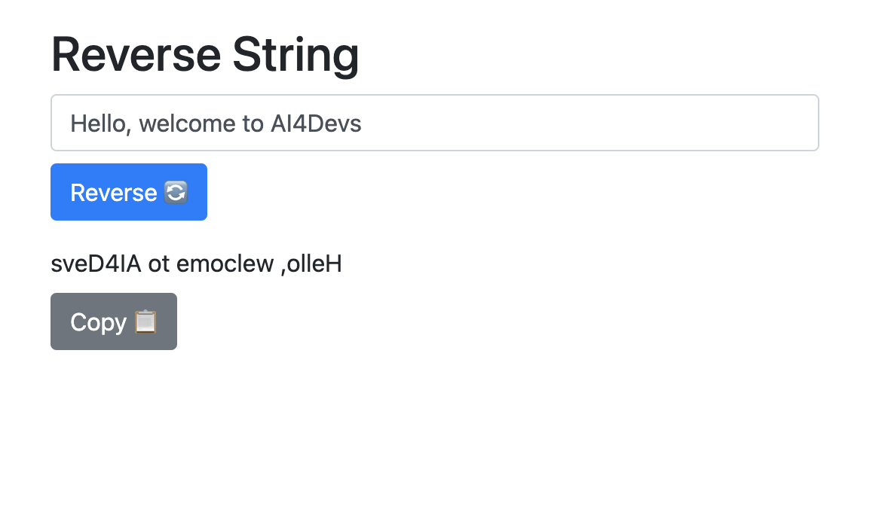

# Usando Claude

## Contexto inicial
Dado el siguiente seed en HTML:

```html
<!DOCTYPE html>
<html lang="en">
<head>
    <meta charset="UTF-8">
    <meta name="viewport" content="width=device-width, initial-scale=1.0">
    <title>Reverse String</title>
</head>
<body>
<script src="script.js"></script>
</body>
</html>
```

## Generación en base al diseño

Haz generado la función que necesito, ahora, podrías generar el HTML (Basado en el seed), el CSS y el JS necesario para poder usarla?

Para ello me gustaría que uses como base la imagen que te estoy adjuntando, la cual contiene un diseño de cómo debería verse y funcionar la página.

### Imagen de referencia


## Corrección
### Corrección de color
Puedes revisar de nuevo la imagen? el botón de Copy debería ser de otro color y falta el ícono de ambos botones

### Añadir ícono
Podrías añadir el caracter unicode que falta a cada botón en base a la imagen que te compartí?

### Añadir salto de línea
Podrías poner un salto de línea entre la caja de texto y el botón de reverse?

### Añadir salto de línea en CSS
Podrías poner los saltos de línea en el css?
