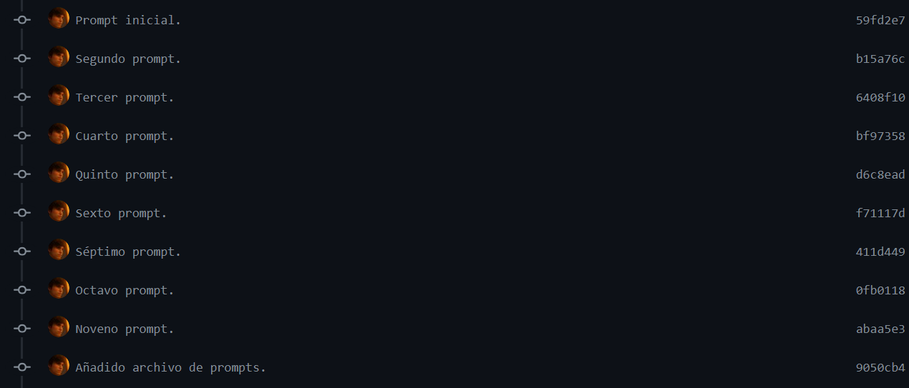

# Juan Solano - PONG

## Probado en
- Chrome
- Firefox
- Edge

## Recursos de audio
- [Pixabai](https://pixabay.com/es/sound-effects/search/pong/?pagi=3)

## Descripción de los prompts
- Cada commit realizado en este proyecto corresponde a un prompt diferente.
- Los commits que tienen que ver con la generación de código empiezan desde el prompt número 3.
- A continuación, se detallan los prompts utilizados para el desarrollo del juego Pong.

## Prompts utilizados
### 1. Conoces el juego pong?
Sí, conozco el juego Pong. Pong es uno de los primeros videojuegos comerciales y fue muy popular en la década de 1970. Aquí hay algunos datos interesantes sobre Pong:

- Fue desarrollado por Atari y lanzado en 1972 como un juego arcade.

- Es un juego de tenis de mesa en 2D. Dos rectángulos (las "paletas") se mueven verticalmente en los lados opuestos de la pantalla y los jugadores compiten golpeando una pelota de un lado a otro.

- Su gameplay simple pero adictivo ayudó a allanar el camino para la industria de los videojuegos tal como la conocemos hoy.

- Pong fue luego adaptado a una consola doméstica en 1975, trayendo los videojuegos a los hogares por primera vez.

- Ha tenido un impacto cultural duradero, con muchas versiones, imitaciones y referencias en la cultura pop a lo largo de las décadas.

- Aunque los gráficos son muy básicos según los estándares actuales, Pong sigue siendo reconocido y jugado hoy en día como un clásico e influyente pionero de los videojuegos.

En resumen, Pong es verdaderamente un hito en la historia de los videojuegos, cuya popularidad ayudó a lanzar a los videojuegos a la corriente principal en los años 70 y más allá. Su diseño atemporal sigue resonando en la actualidad.

### 2. Eres un experto en videojuegos, podrías listarme todas las reglas existentes sobre el juego pong?
   Como experto en videojuegos, puedo decirte que las reglas del Pong son bastante simples y directas. Aquí están todas las reglas básicas del juego:

- El juego se juega entre dos jugadores, cada uno controlando una paleta ubicada en lados opuestos de la pantalla.
- El objetivo de cada jugador es usar su paleta para golpear la pelota hacia el lado opuesto de la pantalla, más allá de la paleta del oponente, para anotar un punto.
- Las paletas sólo pueden moverse verticalmente, hacia arriba y hacia abajo, a lo largo de su lado de la pantalla.
- La pelota rebota en las paletas, las paredes superior e inferior, y se mueve a través de la pantalla a una velocidad constante.
- Si un jugador no logra devolver la pelota y ésta pasa su paleta, el oponente anota un punto.
- El juego continúa hasta que uno de los jugadores alcanza una puntuación predeterminada (a menudo 11 o 21 puntos) y gana el juego con una ventaja de al menos dos puntos.
- Después de cada punto anotado, la pelota se pone nuevamente en juego desde el centro de la pantalla.
- La velocidad de la pelota puede aumentar a medida que el rally continúa, añadiendo más desafío a medida que el juego avanza.
- En algunas versiones, si un rally dura lo suficiente, la pelota puede "atravesar" la paleta en lugar de rebotar, lo que lleva a un cambio de servicio.
- La puntuación generalmente se muestra en la parte superior de la pantalla.

Esas son las reglas principales del Pong en su forma más pura y original. Algunas versiones posteriores y variaciones pueden tener reglas adicionales o ligeramente modificadas, pero este conjunto captura la esencia del clásico juego Pong.

## A partir de aquí lo que haya debajo del número es parte de lo que yo escribí y no lo que contestó Claude.

### 3. Ahora, además de ser un experto en videojuegos, eres un experto programador HTML5, CSS3 y JS ES 2023. Podrías generar los archivos HTML, CSS y JS para el juego pong, teniendo en cuenta las reglas de la 1 a la 10 que me proporcionaste?

### 4. Muy bien! ahora podrías añadirle lo siguiente?

- Efectos visuales cuando la pelota golpee las paletas y las paredes superior e inferior

- Efectos visuales diferentes para las paredes izquierda y derecha

- Sonidos para cuando se golpeen las paletas y la pared superior e inferior.

- Sonido de ganador cuando gane el jugador 1

- Sonido de perdedor cuando gane el jugador 2

- Sonido cuando se haga un punto

### 5. Perfecto! Ahora, podrías hacer lo sigueinte?

- Manten los nombres de los archivos wav, cambiando su extensión por mp3 y añadiendo al inicio del nombre del archivo res/

Es decir, si tengo el archivo paddle_hit.wav, se convertiría en res/paddle_hit.mp3

- Si se están reproduciendo varios sonidos, podrías parar el anterior y darle prioridad al nuevo?

Es decir, si se está ejecutando el sonido de golpe con la pared y en ese mismo momento se reproduce el sonido del dolpe con la paleta, se pararía el sonido de la pared y se reproduciría el de la paleta

- Podrías añadir un sonido al inicio del juego con el mismo formato mp3 del primer punto?

### 6. Perfecto! Ahora podrías hacer lo siguiente?

- Ejecutar el sonido de inicio siempre que se inicia o se resetea el juego

- Añadir un efecto visual a la pelota cada vez que se golpea con las paredes o las paletas

### 7. Perfecto! ahora estoy obteniendo el siguiente error:

Uncaught (in promise) DOMException: play() failed because the user didn't interact with the document first.

Podrías arreglarlo?

También quisiera añadir algo más, podrías hacer que al tocar las paredes o las paletas la pelota sea al menos un 60% más grande?

### 8. Perfecto! Ahora podrías hacer que el juego inicie cuando le de click al tablero? no olvides poner el sonido de inicio ahí en ese evento de click

Adicional, podrías poner una leyenda debajo, que sea visible y que indique que para iniciar el juego se debe hacer click en el tablero?

### 9. Perfecto! ahora, podrías hacer lo siguiente?

- Además de cambiar el tamaño de la pelota cuando golpea contra las paredes o las paletas, podrías cambiar también su color por uno diferente al de las paletas?

- No olvides que después de cambiar su color al golpear, debe volver al original en el mismo tiempo que vuelve a su tamaño original

### 10. Perfecto! ahora, podrías hacer lo siguiente?

- Pon un sonido diferente para cuando el jugador uno haga punto y para cuando el jugador 2 haga punto

### 11. Perfecto! ahora, podrías hacer lo siguiente?

- En la función de stopAllSounds, dejaste el sonido genérico de la puntuación y olvidaste de reemplazarlo por los dos nuevos, podrías arreglarlo?
